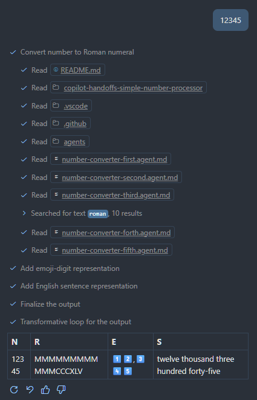

# README

This document contains observations and notes related to the project ["0-awesome-copilot"](https://github.com/topics/0-awesome-copilot). It serves as a reference for key insights, challenges faced, and lessons learned.

## Intentional traps implemented for models to fall into

### Extra Steps that confuse

These two steps cause less-than-state-of-the-art models to omit the table style in the final output.

- The table is generated in agent step #4.
- In step #5, we decorate part of the string.

### Bad Agent Names

Uses first, sed, tri, forth, fif and verify as suffixes just to complicate things a bit.

    

## CHANGELOG

**Ordered from most recent to oldest.**

 

### copilot-handoffs-siumple-skills-number-processor - Observations
---
Now that we have a somewhat consistent experience with both styles, we need to focus on maxmimizing their differences in terms of verbosity vs accuracy.

#### Case: Simplification and adjusting <continue> methods
---

Removing as many of the in-content mentions of <continue> as possi0ble and replacing it with a more explicit "continue-always" keeps everything working well enough.

Removing:

> Do not stop working on this issue until there are no further subagents to run.

Causes the cheaper models to exit prematurely.

In an ideal world I should be able to extract that mention without affecting the prompt. To do so I enabled the Skills feature (experimental) and createde a new skill called: "handoff-continue-logic".

The way how it's implemented by Copilot is that it includes it on its own discretion. So far, it seems to include it 50/50.

Updating the `name` and `description` to `ALWAYS ON SKILL` made it work more often 90-100% of the time.

At the time of writing this **(12/25/2025)**: Skills do not seem to be compatible with OpenAI models. They are siomply ignored. And when the first agent ends executing its part it stops there. 100% of the time.

This makes Skills unusable for my purposes at the moment.

I have documented this behavior in a separate repository for this purpose:

[copilot-handoffs-siumple-skills-number-processor](https://github.com/MarioRicalde/copilot-handoffs-simple-skills-number-processor)

And opened issue [#285075](https://github.com/microsoft/vscode/issues/285075)

  

### 25.2.0 - Observations
---
Now that we have a somewhat consistent experience with both styles, we need to focus on maxmimizing their differences in terms of verbosity vs accuracy.

These cases only affect the following repositories:

- [copilot-handoffs-simple-number-processor v25.2.0](https://github.com/MarioRicalde/copilot-handoffs-simple-number-processor/compare/v25.1.0...v25.2.0)

#### Case: Proper Handoff vs Subagents - Verbosity and Accuracy Trade-off
---
From what can be observed, it seems that both implementations are capable of giving the right results, especially with  state-of-the-art models.

However, the proper handoff implementation tends to be more verbose, while the subagent approach is more concise. Or that's what the observations indicate so far.

The next step is to focus on maximizing the accuracy of both implementations while keeping their verbosity levels as distinct as possible. This will help in understanding the trade-offs between the two approaches better.

#### Case: Setting `prompt` as an empty string
---
As an attempt to lower the verbosity of the handoff implementation, we remove the prompt by setting it to an empty string.

Grok Code Fast 1 (0x) seems to handle this change well, producing less verbose output while maintaining accuracy.

However, Raptor Mini (Preview) struggles with this change, leading to a significant drop in accuracy. It seems that this model relies heavily on the prompt context to guide its output. Especially on the "comma decoration" step.

For the purpose of exploring this path. I'll focus on Grok Code Fast 1 (0x) for now, as it seems to handle the empty prompt scenario better.

  

### 25.2.0 - Observations
---
Now that we have a somewhat consistent experience with both styles, we need to focus on maxmimizing their differences in terms of verbosity vs accuracy.

These cases only affect the following repositories:

- [copilot-handoffs-simple-number-processor v25.2.0](https://github.com/MarioRicalde/copilot-handoffs-simple-number-processor/compare/v25.1.0...v25.2.0)

#### Case: Proper Handoff vs Subagents - Verbosity and Accuracy Trade-off
---
From what can be observed, it seems that both implementations are capable of giving the right results, especially with  state-of-the-art models.

However, the proper handoff implementation tends to be more verbose, while the subagent approach is more concise. Or that's what the observations indicate so far.

The next step is to focus on maximizing the accuracy of both implementations while keeping their verbosity levels as distinct as possible. This will help in understanding the trade-offs between the two approaches better.

#### Case: Setting `prompt` as an empty string
---
As an attempt to lower the verbosity of the handoff implementation, we remove the prompt by setting it to an empty string.

Grok Code Fast 1 (0x) seems to handle this change well, producing less verbose output while maintaining accuracy.

However, Raptor Mini (Preview) struggles with this change, leading to a significant drop in accuracy. It seems that this model relies heavily on the prompt context to guide its output. Especially on the "comma decoration" step.

For the purpose of exploring this path. I'll focus on Grok Code Fast 1 (0x) for now, as it seems to handle the empty prompt scenario better.

  

### 25.1.0 - Observations
---
To create the best agent configuration possible, the following tasks were performed in an attempt to make the agent produce the expected output consistently on Raptor Mini (Preview), another "free" model offered by GitHub Copilot.

- [copilot-handoffs-simple-number-processor v25.1.0](https://github.com/MarioRicalde/copilot-handoffs-simple-number-processor/compare/v25.0.0...v25.1.0)
- [copilot-handoffs-subagent-number-processor v25.1.0](https://github.com/MarioRicalde/copilot-handoffs-subagent-number-processor/compare/v25.0.0...v25.1.0)

#### Case: Raptor Mini (Preview) necessary improvements to avoid premature termination
---

Using Raptor Mini (Preview):

The main issue that we notice when attempting to use 25.0.0 with this particular model is that it tends to terminate prematurely without reaching the final output. It follows through with several steps and, in a very verbose way, communicates them to the user as it progresses.

After looking into the prompt, it seems like Raptor Mini (Preview) is unusually vulnerable to absolute terms. For example:

In the `number-converter-forth.agent.md`, in the description metadata we had:

    Finalizes the output.

Adjusting it to:

    Prepares table output for further processing.

This made the model less likely to terminate prematurely, but the output would no longer match the rules specified in the `number-converter-forth.agent.md`, where the output should be a Markdown table:

    Write a markdown table that includes: <N>, <R>, <E>, and <S>, then continue with #tool:agent/runSubagent number-converter-fif

The agent would continue into the next agent step, but it would avoid outputting the table we requested because the `number-converter-fif.agent.md` modified the table to include decorated emojis (commas).

This process, by itself, caused the model to not output the expected table. Instead, it would output a verbose message indicating the steps it was taking without producing the final output.

#### Case: Raptor Mini (Preview) improvements overview
---

After performing equivalent chnages to both repositories the output seems to have stabilized providinmg consistent experineces with Raptor mini (Preview); albeit, not as consistently as desired.

The model still struggles to produce a non-verbose response without adding further limiters to the prompt.

For the time being I am going to label this 25.1.0 as concluded for testing and have the next versions focus on improving the accuracy of the output across all models.

  

### 25.0.0 - Observations
---
The following repositories are referenced across all of the following cases:

- [copilot-handoffs-simple-number-processor v25.0.0](https://github.com/MarioRicalde/copilot-handoffs-simple-number-processor/tree/v25.0.0)
- [copilot-handoffs-subagent-number-processor v25.0.0](https://github.com/MarioRicalde/copilot-handoffs-subagent-number-processor/tree/v25.0.0)

#### Case: Handing off between agents with different tool access
---

Using Grok Code Fast 1 (0x).

If you don't limit the tools available to the model, it tends to read the content of all agents and do unnecessary things. This makes the operation take longer and produces less relevant output.

#### Case: `copilot-handoffs-subagent-number-processor` instead of proper handoff
---

Using Grok Code Fast 1 (0x).

When not specifying `handoff` properly, and instead using:

    #tool:agent/runSubagent number-converter-second

The model seems to follow the instructions and use subagents to follow the chain of agents required to produce the output; however, the output is less relevant and less accurate than when using a proper handoff.

In practice, it tends to fail quite a bit at producing the correct final output; however, it's possible that updating the agents to include some of the context that was lost from the handoff prompt will help.

It struggles quite a bit with producing the table, but it succeeds at performing most of the agent steps correctly.

In comparison to the proper handoff implementation, the accuracy of this approach is significantly lower.

#### Case: Complicating Agent Names
---

Using Grok Code Fast 1 (0x).

When complicating the agent names, not much variation occurred in either variant. The model still managed to follow the handoff and produce its respective output.

#### Case: Adjusting Context to improve output consistency
---

Using Grok Code Fast 1 (0x).

When adjusting both repositories' prompts to include more context in the 4th and 5th steps, both outputs improved in consistency by a significant margin.

My thoughts on the matter were correct. Providing the additional context lost from the handoff prompt helps the model produce the table output with the decorated emoji numbers more consistently.

But as of now, based on the results I am getting:

- Proper handoff is inconsistent and more verbose than I expected. It seems to fail the adding commas between emojis digits more often than I would like it to fail considering all the verbosity needed to perform the handoffs reliably.
- Using subagents is more consistent, and less verbose. It continues to fail on the comma separated step from time to time, but the success rate is higher.

#### Case: Unexpected model behavior with Raptor Mini (Preview)
---

Using Raptor Mini (Preview):

The behavior observed by the agent is not consistent with the previous observations, nor with the intended behavior of the agents.

It seems to be consistently unable to produce the simple table output. Instead, it takes a verbose route and mentions individual step results without producing the intended final output.

It struggles to follow the chain and tends to abort before reaching the end, with a message along the lines of "Next step: ".
