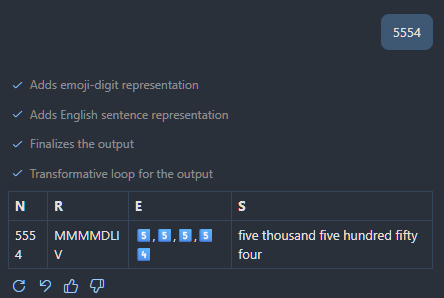
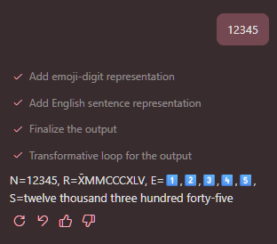

# OBSERVATIONS

This document contains observations and notes related to the project. It serves as a reference for key insights, challenges faced, and lessons learned.

## Important intentional traps implemented for the models to fall into:

These 2 steps causes less-than-state-of-the-art models to ommit the table style in the final output.

- Table is generated on agent step #4.
- On step #5 we decorate part of the string.

## 12/20/2025-12/22/2025

### Case: Handing off between agents with different tool access

Using Grok Code Fast 1 (0x).

If you don't limit the tools available to the model, it tends to read the content of all agents and do unnecessary things. Making the operation take longer and produce less relevant outputs.




### Case: `copilot-handoffs-subagent-number-processor` instead of proper handoff

Using Grok Code Fast 1 (0x).

When not using specifying `handoff` properly, and instead we use:

```prompt
#tool:agent/runSubagent number-converter-second
```

The model seems to properly follow the instructions and use the subagents to properly follow the chain of agents required to produce the output; however, the output is less relevant and less accurate than when using proper handoff.



In pracftice it tends to fail quite a bit in producing the correct final output; however, it's possible that updating the agents to include some of the context that was lost from the handoff prompt will help.

It struggles quite a bit with producing the table. But succeeds at performing most of the agent steps correctly.

In comparison to the proper handoff implementation, the accuracy on the competing approach is significantly higher.

### Case: Complicating Agent Names

Using Grok Code Fast 1 (0x).

When complicating the agent names, not a lot of variation happened in either varioant. The model still managed to follow the handoff and produce their respective outputs.

### Case: Adjusting Context to improve output consistency

Using Grok Code Fast 1 (0x).

When adjusting both repositories prompts to include more context on the 4th and 5th steps. Both outputs imrpoved consistency by a singificant margin.

My thoughts on the matter were correct. Providing the additional context lost from the handoff prompt helps the model produce the table output with the decorated emoji numbers more consistently.

But as of now, based on the results I am getting:

- Proper handoff is inconsistent and more verbose than I expected.
- Using subagents is more consistent, and less verbose.

